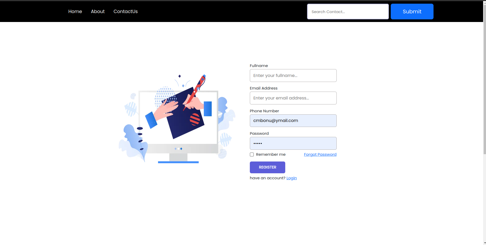
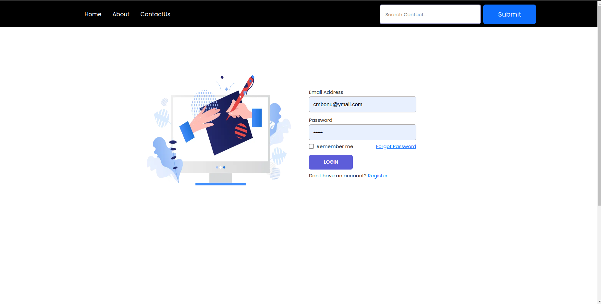
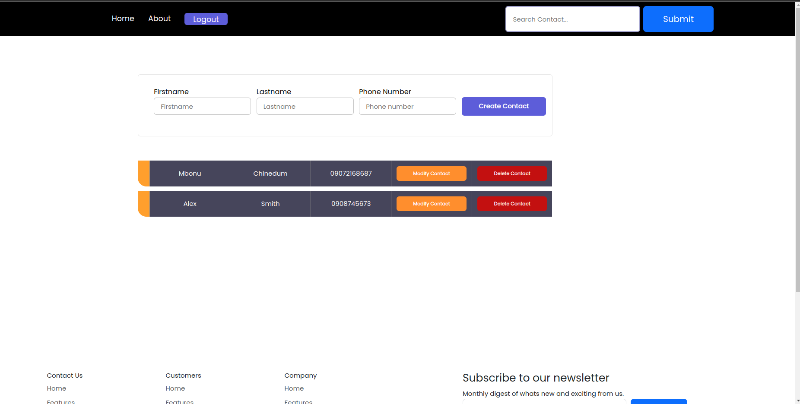
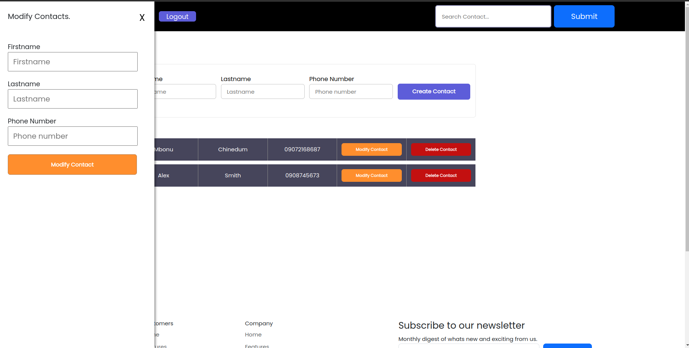

# hux-assessment-frontend

This repository contains a React application with basic authentication functionality. The application includes registration, login, and a protected dashboard route. The routes are guarded based on the user's authentication status.

## Features

- **Register**: Users can register for an account.
- **Login**: Users can log in to access protected routes.
- **Dashboard**: A protected route that only authenticated users can access.
- **Persistent Login**: Uses localStorage to persist the authentication token.

## Technologies Used

- React
- React Router
- Context API for authentication management
- localStorage for token persistence

## Component Structure

- **App**: Main component handling routing and authentication context.
- **Home**: Registration component.
- **Login**: Login component.
- **Dashboard**: Protected dashboard component.
- **AuthContext**: Context for managing authentication state.

## Setup and Installation

1. Clone the repository:
    ```bash
    git clone https://github.com/cboychinedu/hux-assessment-frontend
    cd hux-assessment-frontend
    ```

2. Install dependencies:
    ```bash
    npm install .
    ```

3. Set up environment variables:
    Create a `.env` file in the root directory if needed.

4. Run the application:
    ```bash
    npm start
    ```

## Usage

### Routes

- **Home**: Accessible at `/`, used for user registration.



- **Login**: Accessible at `/login`, used for user login.



- **Dashboard**: Accessible at `/dashboard`, a protected route that requires authentication.





### Authentication Flow

1. **Register**: 
    - Users can register by providing necessary details on the registration page.
2. **Login**: 
    - Users can log in by providing their credentials on the login page.
    - On successful login, an authentication token is stored in localStorage.
3. **Accessing Protected Routes**:
    - If a user is logged in (i.e., a token is present in localStorage), they can access the dashboard.
    - If not logged in, they are redirected to the login page.

## Context API

The `AuthContext` provides the following:

- `isLoggedIn`: Boolean indicating if the user is logged in.
- `xAuthToken`: The authentication token.
- `setToken`: Function to set the authentication token.

## Code Explanation

### App Component

The `App` component manages routing and authentication state.

- **State**: No internal state, relies on `AuthContext`.
- **Context**: Uses `AuthContext` to get and set the authentication token.
- **Routes**:
  - **Unprotected**: `/` (Home) and `/login` (Login).
  - **Protected**: `/dashboard`, accessible only if `isLoggedIn` and `xAuthToken` are true.


